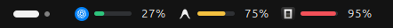
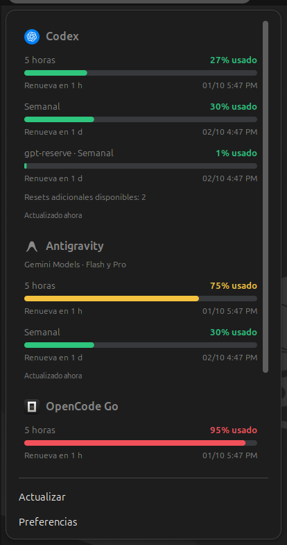
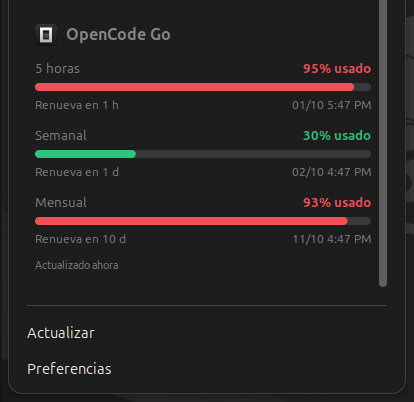
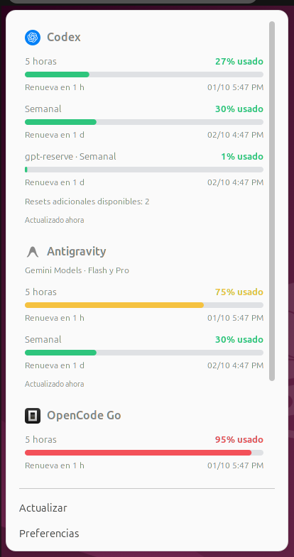

# Quota Panel

Tus cuotas de **Codex, Antigravity y OpenCode Go** en el panel superior de GNOME Shell. Un vistazo al consumo de cinco horas; un clic para ver los límites de tu plan y cuándo se renuevan.



## Qué muestra

| Servicio        | Cuotas y detalles                                                                                                 |
| --------------- | ----------------------------------------------------------------------------------------------------------------- |
| **Codex**       | Ventana de cinco horas, cuota semanal, otros límites entregados por el servicio y resets adicionales disponibles. |
| **Antigravity** | Cinco horas y cuota semanal del grupo compartido **Gemini Models**, que incluye Flash y Pro.                      |
| **OpenCode Go** | Cinco horas, cuota semanal y cuota **mensual**.                                                                   |

Las barras indican el porcentaje **consumido**: verde por debajo del 70%, amarillo desde el 70% y rojo desde el 90%. Los umbrales se pueden ajustar. El panel prioriza la cuota de cinco horas; si un servicio no ofrece esa ventana, muestra su cuota disponible más consumida.

El desplegable queda centrado debajo de los indicadores, a la izquierda de la pantalla. Incluye barras, cuenta regresiva, fecha de renovación en formato de 12 horas (AM/PM) y antigüedad del dato. La rueda tiene desplazamiento animado y el touchpad conserva su movimiento directo; las actualizaciones mantienen las filas y la posición de lectura.

## Capturas

Capturas de la extensión ejecutándose en **GNOME Shell 46**, con datos de demostración.

| Menú en tema oscuro                                                                                                           | Cuotas de OpenCode Go                                                                                                                                                       |
| ----------------------------------------------------------------------------------------------------------------------------- | --------------------------------------------------------------------------------------------------------------------------------------------------------------------------- |
|  |  |

<details>
<summary>Ver el menú en tema claro</summary>



</details>

## Requisitos

- **GNOME Shell 46**, en X11 o Wayland. Es la versión declarada y validada por esta extensión.
- **Python 3**, GTK4/libadwaita y `glib-compile-schemas`.
- **Codex CLI** y **Antigravity CLI (`agy`)** instalados y con sesión iniciada.
- Una conexión **OpenCode Go** configurada en OpenCode.

En Ubuntu 24.04 puedes instalar las dependencias del sistema con:

```bash
sudo apt install python3 python3-gi gir1.2-gtk-4.0 gir1.2-adw-1 libglib2.0-bin
```

Node.js y GJS se usan para las pruebas de desarrollo. El auxiliar de cuotas está escrito en Python; Codex puede necesitar Node.js si lo instalaste mediante npm.

## Instalación

Desde una copia del proyecto:

```bash
bash scripts/install.sh
```

El script construye el paquete, lo instala para tu usuario y solicita su activación. El archivo generado es `dist/quota-panel@extensions.local.shell-extension.zip`; la extensión se instala en `~/.local/share/gnome-shell/extensions/quota-panel@extensions.local`.

Si GNOME no reconoce la extensión recién instalada, recarga Shell y actívala:

- **X11:** `Alt+F2`, escribe `r` y pulsa Enter.
- **Wayland:** cierra la sesión y vuelve a entrar.

```bash
gnome-extensions enable quota-panel@extensions.local
```

También puedes construir e instalar el paquete por separado:

```bash
python3 scripts/build.py
gnome-extensions install --force dist/quota-panel@extensions.local.shell-extension.zip
```

Al actualizar el código JavaScript de una extensión ya cargada, recarga Shell siguiendo los pasos anteriores para que GNOME use la nueva versión.

## Conectar tus cuentas

### Codex

Inicia sesión en el CLI con tu cuenta de ChatGPT. La extensión consulta `account/rateLimits/read` mediante `codex app-server --stdio`. Una API key de OpenAI no representa las cuotas de la suscripción ChatGPT.

### Antigravity

Inicia sesión en `agy` y comprueba que funcione:

```bash
agy --print /usage --output-format json
```

La integración está validada con **agy 1.2.14**. Usa el comando de cuotas incorporado del CLI, con cero turnos del modelo y cero tokens en la consulta validada. Solo muestra el grupo compartido **Gemini Models**; no suma porcentajes de Flash y Pro ni utiliza las credenciales del CLI Gemini independiente.

### OpenCode Go

Abre OpenCode y conecta **OpenCode Go** mediante `/connect`. La extensión utiliza la entrada `opencode-go` de `${XDG_DATA_HOME:-~/.local/share}/opencode/auth.json` para consultar el uso de tu plan Go.

Las consultas funcionan sin mantener abiertos los editores o las interfaces de los CLIs. La extensión inicia procesos auxiliares breves cuando necesita consultar Codex o agy.

## Preferencias

Abre **Preferencias** desde el menú de la extensión o ejecuta:

```bash
gnome-extensions prefs quota-panel@extensions.local
```

| Ajuste                | Valor inicial                                                         |
| --------------------- | --------------------------------------------------------------------- |
| Umbral amarillo       | 70% consumido                                                         |
| Umbral rojo           | 90% consumido                                                         |
| Intervalo de consulta | 60 segundos, configurable entre 30 y 900                              |
| Rutas de Codex y agy  | Detección automática; puedes indicar rutas absolutas y pulsar Aplicar |

La detección busca los ejecutables en `PATH`, `~/.local/bin`, `~/.opencode/bin` y las instalaciones de Node de NVM. El desplazamiento de la rueda respeta la preferencia de animaciones de GNOME.

## Actualización, privacidad y límites

- La extensión **solo consulta**: no envía prompts al modelo, compra créditos ni canjea resets.
- Al abrir el menú o pulsar **Actualizar** solicita datos nuevos, con un mínimo de 15 segundos entre consultas manuales. Los errores espacian los reintentos hasta 15 minutos y el auxiliar tiene un límite total de 45 segundos.
- Si falla la conexión o vence una sesión, conserva el último dato disponible y muestra su estado y antigüedad. Para recuperar una sesión, vuelve a iniciar sesión en el CLI correspondiente.
- La caché `~/.cache/quota-panel/quotas.json` contiene cuotas y estados normalizados, sin tokens ni identidad de cuenta. La clave de OpenCode se utiliza en memoria para su petición y no se copia a esa caché.
- agy se ejecuta desde `~/.cache/quota-panel/agy`, con la actualización automática del CLI desactivada durante la consulta. Sus logs habituales siguen siendo gestionados por agy.
- Los datos proceden de los proveedores. Si faltan porcentajes, ventanas, fechas o resets, se indica que no están disponibles. Una fecha vencida aparece como renovación pendiente hasta confirmar el nuevo consumo.
- La compatibilidad con otros GNOME Shell no está declarada. Los formatos de los CLIs y el endpoint de OpenCode Go pueden cambiar y requerir una actualización del adaptador.

Los íconos se incluyen en el paquete. Su procedencia está documentada en [icons/SOURCES.md](icons/SOURCES.md).

## Privacidad del repositorio

El UUID `quota-panel@extensions.local` es genérico. Las capturas usan datos ficticios y no incluyen metadatos de creación. Los commits deben usar el correo `noreply` de GitHub; los controles locales revisan credenciales, correos y archivos privados antes de guardar o publicar cambios.

Consulta [SECURITY.md](SECURITY.md) para activar los hooks en una copia nueva y conocer los límites del detector.

## Desarrollo

```bash
npm test
npm run build
```

Las pruebas cubren normalización, grupos Gemini compartidos, ventanas faltantes, resets, colores, cuenta regresiva, conservación de datos, protocolos de los CLIs y cierre de procesos. Los tres proveedores también se comprobaron con sesiones reales.

Para probar los actores, el menú y el desplazamiento dentro de un GNOME aislado:

```bash
npm run test:shell
```

La prueba utiliza cuotas ficticias y comprueba fotogramas intermedios de la rueda, movimientos rápidos, inversión de dirección, touchpad, límites, actualizaciones sin perder el scroll y desactivación/reactivación sin duplicados. Guarda los resultados en el directorio temporal que imprime. Necesita GNOME Shell y acceso a D-Bus/composición gráfica; no cambia la configuración de tu sesión de escritorio.

Para regenerar las capturas del README:

```bash
python3 tests/shell-smoke.py --screenshots docs/screenshots
```

## Diagnóstico y desinstalación

Verifica el estado de la extensión:

```bash
gnome-extensions info quota-panel@extensions.local
```

Consulta los proveedores desde el auxiliar, sin imprimir credenciales:

```bash
python3 backend/collector.py <<'JSON'
{"providers":["codex","antigravity","opencode"]}
JSON
```

Si aparece un error al cargarla, revisa el registro de tu sesión con `journalctl --user -b -o cat` y busca `quota-panel@extensions.local`.

Para desinstalarla:

```bash
gnome-extensions disable quota-panel@extensions.local
gnome-extensions uninstall quota-panel@extensions.local
```

## Referencias

- [Codex App Server](https://learn.chatgpt.com/docs/app-server)
- [Cuotas de agy: `/usage`](https://www.antigravity.google/docs/cli/commands/usage/)
- [Instalación y autenticación de agy](https://www.antigravity.google/docs/cli/install/)
- [Modo headless de agy](https://www.antigravity.google/docs/cli/headless/)
- [Implementación del endpoint de OpenCode Go](https://github.com/anomalyco/opencode/blob/dev/packages/console/app/src/routes/zen/go/v1/usage.ts)
